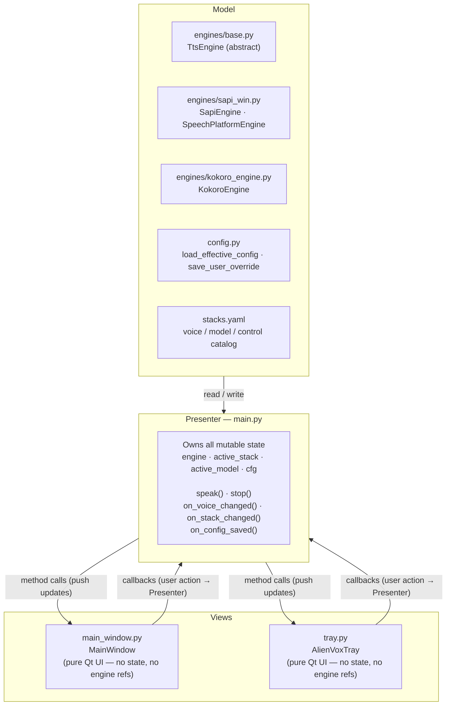
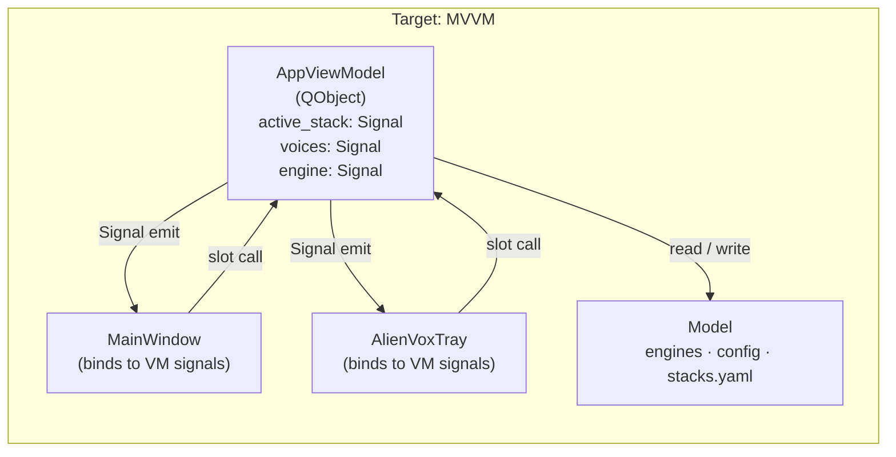

# Cross-Platform Architecture & Development Guidelines

This skill codifies the architectural, structural, and testing standards required to build low-latency, deterministic, cross-platform components for AlienTech.Software projects (such as AlienVox). It is **technology-agnostic**; implementation-specific details (language, framework, crates, packages) live in each implementation's own `docs/adr/` folder.

## 1. Core Principles

### Factory Owner, Not Coder
- **Anchor to Intent:** Your goal is to express and fulfill the developer's exact stated intent. If instructions or requirements are ambiguous, you must stop and ask; never silently infer context.
- **Zero Shortcuts:** You are strictly forbidden from taking shortcuts, collapsing multiple complex tasks into single compromises, or skipping steps because an implementation is complex. Keeping an application simple means executing clean, unbloated designs—it *never* means delivering an incomplete, cut-corner, or incorrect feature.
- **Surface Assumptions:** Explicitly state what you are about to assume and wait for user confirmation before executing any code changes.

### Anti-Mocking Testing Philosophy
- **Real Code Execution:** Mocking dependencies is strongly discouraged. Unit tests and functional integration pipelines must execute actual, deterministic code branches against real buffers wherever possible.
- **Concrete Test Data:** Provide explicit, real-world mock data files, clipboard structures, or memory state vectors to test genuine logic rather than simulating structural responses through arbitrary mock interfaces.

---

## 2. Structural Patterns: The Bridge & Suffix Isolation

Every system-level subsystem must be separated into a platform-agnostic abstract contract layer and isolated, platform-specific concrete implementations.

### 2.1 File Suffix Mapping Rules
For standalone or lightweight structural integrations, use strict suffix tracking:
- `*._core.*` / `*._base.*` — Contains the common interface/protocol definition. Absolutely no platform imports allowed.
- `*_win.*` — Isolated platform execution for Windows 11 (Win32, COM, UI Automation APIs).
- `*_mac.*` — Isolated platform execution for macOS 14+ (Cocoa, AppKit, AVFoundation APIs).
- `*_lnx.*` — Isolated platform execution for Linux kernels (X11, Wayland, DBus).

### 2.2 Subsystem Directory Isolation
For intricate multi-file pipelines (e.g., local OCR engines or native accessibility tree scrapers), separate modules inside platform-specific child directories managed by a top-level dispatcher:

```text
engines/<subsystem-name>/
├── __init__ / mod       # Directs dispatch dynamically based on platform
├── base                 # Houses the abstract protocol or shared definitions
├── win/                 # Fully cordoned Windows logic paths
│   └── text_grabber
└── mac/                 # Fully cordoned macOS logic paths
    └── text_grabber
```

---

## 3. Single-Application Runtime — Non-Negotiable

AlienVox **MUST** ship as one application: a single process, a single executable, no external runtime dependencies at inference time. There is no separate backend process, sidecar server, or second runtime interpreter. Any design that splits the runtime into multiple applications violates this rule.

The implementation language (chosen per each implementation's ADR-001) is the runtime that calls all TTS models — either natively in-process or through OS APIs. No subprocess calls to an external interpreter at inference time are permitted; that pattern is hidden-backend architecture in disguise.

---

## 4. Model Integration Paths

### 4.1 Path A — Cloud / Remote Models
- Hosted TTS providers (e.g., OpenAI, ElevenLabs, Azure) are HTTPS REST/streaming APIs.
- Call them directly from within the app process using an async HTTP client, consuming streamed audio chunks to preserve low latency.
- API keys resolve from native system environment variables or `.gitignore`-d local files — never hard-coded or committed.

### 4.2 Path B — Local / Open-Source ML TTS Models
Open-source neural TTS models must be integrated **in-process** — no subprocess calls to an external interpreter at runtime.
- **ONNX Runtime** — export the model to ONNX and run inference in-process (e.g., Piper-style TTS). Preferred default for cross-language portability.
- **Native ML framework** — use the language-native ML library to load and run the model directly (e.g., PyTorch in Python).
- **Bundled native inference binary** — a compiled engine driven from the app process as a linked library, not a subprocess.

### 4.3 Native OS TTS Fallback
Local, zero-dependency speech via the platform's built-in engine is the fastest fallback and must always be available:
- **Windows:** SAPI5 / WinRT via COM or the platform's native binding.
- **macOS:** AVFoundation / `NSSpeechSynthesizer` via the `mac` platform path.

### 4.4 Constraint Summary
- "Call other TTS models from inside the app" means in-process native inference — never a subprocess spawning an external interpreter.
- The model-integration layer follows the Bridge & suffix isolation rules of Section 2 like any other subsystem.

---

## 5. Configuration — One-Way Data Flow

Every configurable setting in AlienVox is owned by a YAML descriptor on disk. The
engine layer, the UI, and telemetry all **read** from the merged config; user input
**writes** back to the config file and the app reloads. No code path mutates engine
state, UI widgets, or persisted values out-of-band. This keeps state single-sourced,
diffable, and testable without a running app.

### 5.1 Read / Write Directions

- **Read (fan-out)**: YAML → engine construction, YAML → UI control rendering, YAML → telemetry stack configuration.
- **Write (single sink)**: user input → YAML file → reload → fan-out again.
- The UI **must not** hard-code model-specific fields (voice lists, rate/pitch ranges, install manifests). If a knob isn't declared in YAML, it isn't rendered. Adding a new model means dropping a folder with `model.yaml` — no application code edits.
- The engine **must not** cache setting values past a reload. Every `speak` reads the effective config for the current stack/model/voice.

### 5.2 Four-Layer Config Hierarchy

Later layers override earlier ones. The resolver merges bottom-up and hands the
flattened view to both the engine and the UI.

| # | Layer | Location | Purpose |
| :--- | :--- | :--- | :--- |
| 1 | Built-in defaults | Compiled into the engine | Baseline values so a missing YAML never crashes the app. |
| 2 | Stack config | `.models/<stack>/stack.yaml`, `.apis/<provider>/provider.yaml` | Stack- or provider-wide settings (default TTL, models root, API base URL, auth env-var name). |
| 3 | Model / voice config | `.models/<stack>/<model>/model.yaml` | Per-model knobs, voice roster, install manifest, UI hints (control ranges, labels, which sliders apply). |
| 4 | User overrides | Platform app-data dir (e.g. `%LOCALAPPDATA%\<identifier>\user.yaml` on Windows) | Last-picked engine/model/voice, slider values, hotkey binding — the persisted UI state. |

### 5.3 Concrete Paths

- Stacks live under `.models/<stack>/`.
- Cloud providers live under `.apis/<provider>/` alongside `.models`.
- All paths resolve through a unified path-resolution utility in the implementation (see that implementation's ADR for specifics). The config resolver reuses that search order — it does **not** invent its own path scheme.
- Secrets referenced by `provider.yaml` (API keys) resolve from OS environment variables named in the YAML; the key value is never written into any YAML on disk (per `workspace-discipline` §2 secret cordoning).

### 5.4 UI Hint Schema (informative)

Model YAML declares what the UI should render, so the frontend is a generic renderer:

```yaml
# .models/ml/kokoro/model.yaml (illustrative)
id: kokoro
name: Kokoro-82M
voices:
  - { id: af_heart, label: "American F · Heart" }
  - { id: bm_george, label: "British M · George" }
controls:
  rate:   { min: -10, max: 10, default: 0, applies: true }
  pitch:  { applies: false }     # Kokoro ignores pitch — hide the slider
  volume: { min: 0, max: 100, default: 100, applies: true }
  ttl_seconds: { min: 0, max: 300, default: 30, applies: true }
```

An engine that doesn't map a field marks it `applies: false`; the UI reclaims the
space (aligns with `ui_ux_design` §2.2). This replaces ad-hoc per-model branches in
the engine and the frontend.

### 5.5 Consequences

- **Adding a stack, provider, or model is data-only** in the steady state.
- **Persistence is trivial**: writing `user.yaml` is the only mutation site.
- **Diffing is straightforward**: `git diff` on the config folder shows exactly what changed between runs.
- **Testing is decoupled**: engine and renderer tests take a YAML fixture instead of mocking IPC.

---

## 7. Python App — UI Architecture Pattern

### 7.1 Current Pattern: MVP (Model-View-Presenter)

The Python app (`python_app/`) uses **MVP with callbacks**, not MVC or MVVM. The distinction matters because it explains which bugs are natural and which require discipline to avoid.



**Key invariant**: Views hold **no mutable application state** and have **no direct references to engine objects**. Every user action fires a callback into the Presenter. The Presenter mutates state and pushes updates back to the View via explicit method calls (`update_voices()`, `set_speaking()`, etc.).

### 7.2 Why Not MVVM?

MVVM would place observable properties (`active_stack`, `engine`, `voices`) on a **ViewModel** object. The View would bind to those properties and update automatically when they change — no explicit push calls needed. The tab-switch bug (2026-07-20: switching engine tabs didn't swap the engine) is the canonical symptom of MVP without full state routing: the View fired an event, but the Presenter had no registered handler for it yet.

In MVVM that bug is structurally impossible: `active_stack` is an observable on the ViewModel; the View binds to it; changing it automatically triggers the engine-swap side-effect.

**Adopting MVVM in PySide6** requires:
- A `AppViewModel` class with `Signal`-backed properties (`active_stack_changed = Signal(str)`, etc.)
- Views connect to those signals rather than receiving injected callbacks
- The Presenter role dissolves into the ViewModel

This is the correct long-term direction. Until then, every new user action (tab switch, model change, hotkey rebind) **must have an explicit callback registered** in `main.py` — document the gap in `todo_001.md` when one is missing.

### 7.3 Callback Contract

Every View → Presenter boundary must be declared in `MainWindow.__init__` as a named `Callable` parameter. No implicit event routing, no direct method calls from View into `main.py`. The full contract as of 2026-07-20:

| Callback | Fired when | Presenter action |
| :--- | :--- | :--- |
| `on_speak(text)` | Play button / hotkey | `speak_async(text)` |
| `on_stop()` | Stop button | `engine.stop()` |
| `on_voice_changed(voice_id)` | Voice dropdown changes | update `cfg["voice"]`, save |
| `on_stack_changed(stack_id, voice_id)` | Engine tab switches | swap `engine`, update `cfg["engine"]`, save |
| `on_config_saved(patch)` | Slider released | `save_user_override(patch)` |
| `on_about()` | About button | open `AboutDialog` |

Any new UI control that changes application state **must** add a row to this table and a corresponding parameter to `MainWindow.__init__`.

### 7.4 Migration Path Toward MVVM

When the callback table exceeds ~10 entries or state synchronisation bugs recur, migrate incrementally:

1. Extract `AppState` dataclass: `active_stack`, `active_model`, `voice_id`, `engine`, `cfg`.
2. Wrap it in `AppViewModel(QObject)` with `Signal` properties.
3. Replace injected callbacks with signal connections in `MainWindow.__init__`.
4. `main.py` becomes a thin bootstrap: instantiate `AppViewModel`, connect signals, start Qt event loop.



Record this migration as `python_app/docs/adr/adr-003-mvvm-migration.md` when the decision is made.

---

## 6. Architecture Decision Records (ADRs)

All significant, long-lived architecture decisions for an AlienVox implementation are recorded as ADRs in that **implementation's** `docs/adr/` folder (e.g. `gemini_poc/docs/adr/`, `python_app/docs/adr/`). Before proposing or implementing a large design change, **consult the existing ADRs** for prior decisions and constraints, and **record new large design decisions** as a new `adr-00N-<slug>.md` following the established format (Status, Date, Context, Decision, Consequences, Related Decisions). Keep ADRs cross-linked.

Outer project ADRs (under `tts/docs/adr/`) are reserved for project-wide, technology-agnostic decisions only. Implementation-specific ADRs (stack selection, deployment model, path resolution, engine architecture) belong inside the implementation folder per the `workspace-discipline` Doc Location Rule.
