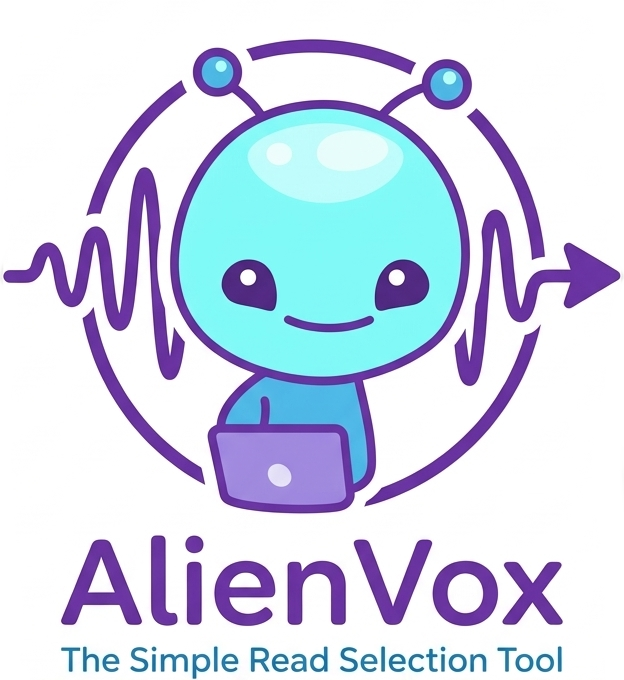

<p align="center">
  
</p>

<p align="center">
  
  <br>
  <strong>AlienVox</strong> — lightweight tray-first selection TTS prototype for Windows/macOS
</p>

---

AlienVox is a minimal prototype focused on speaking exactly the selected text through a native tray/status menu experience.

## What this repo contains

- `gemini_poc/` — active prototype implementation
- `.agents/` — AI assistant rules and skills
- `.githooks/` — local Git hook enforcement for commit hygiene
- `docs/` — design requirements and branding assets
- `LICENSE` — MIT license

## Current MVP scope

- Native tray/status menu with a small options pane
- One local TTS provider (Windows TTS acceptable)
- One open-source ML/AI TTS provider
- No main application window during normal use

## Setup notes

1. Enable local Git hooks:

```bash
cd C:\dev\tts
git config core.hooksPath .githooks
```

2. Ensure the root symlinks are available:

- `SKILLS` → `.agents/SKILLS`
- `AGENT.md` → `.agents/AGENT.md`

## Useful links

- [Prototype code](gemini_poc/)
- [Agent guidance](AGENT.md)
- [Agent skills](SKILLS/)
- [Design docs](docs/)
