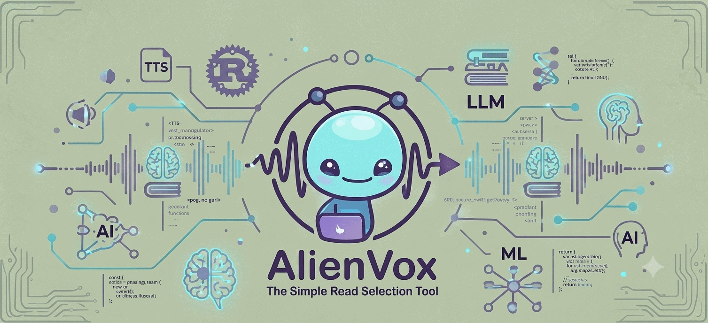
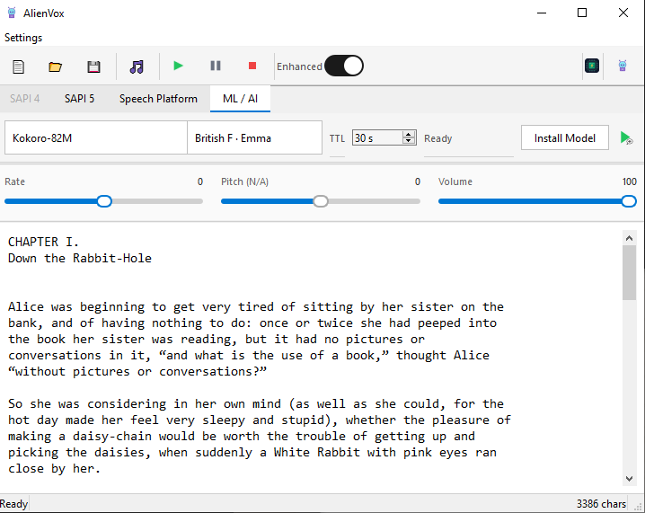

<div align="center">

# AlienVox

Simple, standalone TTS apps — high quality, zero friction. Start with **Speak Selection**: highlight any text on your desktop, press a global hotkey, and hear it spoken aloud instantly.





[](https://www.python.org/downloads/)
[](https://doc.qt.io/qtforpython-6/)
[](LICENSE)
[](3P.md)

</div>

---

## What is AlienVox?

AlienVox is a lightweight **system-tray utility** for Windows that turns any selected text into speech. Think of it as a modern, extensible replacement for the built-in "Speak Selection" feature — but with support for multiple TTS engines:

| Stack | Engine | Platform | Type |
|-------|--------|----------|------|
| `sapi5` | Windows SAPI 5 COM | Windows | Built-in OS voice |
| `speech_platform` | Windows Speech Platform | Windows | Server runtime voices |
| `ml` | Kokoro-82M / Piper / Dia / VibeVoice | Any | Open-source ML models |

### Features

- **Tray-first design** — lives quietly in your system tray, no persistent window needed.
- **Global hotkey** — `Ctrl+Esc` by default, highlight text and press to speak.
- **Multi-engine support** — swap between SAPI5, Speech Platform, or open-source ML models.
- **Voice selection** — dropdown in tray menu for built-in voices; ML model voices from `stacks.yaml`.
- **Playback controls** — rate, pitch, volume sliders in the testing window.
- **Four-layer config** — built-in defaults → `stacks.yaml` → `user.yaml` → CLI overrides.
- **Telemetry** — dual-sink (stderr + JSONL file), privacy-safe (never logs source text).
- **Single executable** — PyInstaller-frozen `.exe`, no Python installation required at runtime.

## Quick Start

### Prerequisites

- **Python 3.11+**
- **Windows 10/11** (SAPI5 engine); macOS/Linux for ML engines only

### Install

```bat
cd C:\dev\tts\python_app
python -m venv .venv
.venv\Scripts\activate
pip install -r requirements.txt
```

### Run

```bat
python run.py app
```

This launches the tray icon + optional Balabolka-style testing window on startup.

## Project Structure

```
tts/
├── python_app/              # Active implementation (Python + PySide6)
│   ├── src/
│   │   ├── main.py          # Entry point — tray-first app
│   │   ├── tray.py          # QSystemTrayIcon + context menu
│   │   ├── main_window.py   # Balabolka-style testing window
│   │   ├── capture.py       # Text selection (WM_COPY → clipboard fallback)
│   │   ├── hotkey.py        # pynput global hotkey listener
│   │   ├── config.py        # Four-layer YAML config resolution
│   │   ├── telemetry.py     # Dual-sink telemetry (stderr + JSONL)
│   │   ├── engines/
│   │   │   ├── base.py      # TtsEngine ABC, Voice dataclass
│   │   │   ├── registry.py  # Reads stacks.yaml → StackInfo list
│   │   │   └── sapi_win.py  # Windows SAPI5 via pywin32 COM
│   │   └── resources/icons/ # Tray icons (idle/speaking/error)
│   ├── tests/               # 37+ tests, ≥80% coverage
│   ├── stacks.yaml          # Bundled config: all stacks, models, voices
│   ├── run.py               # Task runner: app | build | test | lint | cov
│   └── pyproject.toml       # pytest + ruff + coverage config
├── .agents/                 # AI agent guidance & skills
└── docs/                    # ADRs, technical requirements, SOTA research
```

## Configuration

AlienVox uses a **four-layer config system**:

1. **Built-in defaults** — hardcoded in code
2. **`stacks.yaml`** — bundled next to the executable (dev: next to `setup.py`)
3. **`user.yaml`** — user overrides (`%LOCALAPPDATA%/com.alientech.alienvox/user.yaml`)
4. **CLI overrides** — command-line arguments

Edit `stacks.yaml` to declare stacks, models, voices, and controls. User preferences go in `user.yaml`.

## Examples

Sample input/output demonstrating the text-enhancement pipeline (`docs/sampels/`):

- [Alice's Adventures in Wonderland.txt](docs/sampels/Alice's%20Adventures%20in%20Wonderland.txt) — real book text, including line-wrapped paragraphs and markdown-style links, used as a regression fixture for `heuristic_enhance()`.
- [Alice's Adventures in Wonderland_gb_export.mp3](docs/sampels/Alice's%20Adventures%20in%20Wonderland_gb_export.mp3) — the audio exported from that text via AlienVox's Export feature. GitHub's README sanitizer strips `<audio>` tags entirely (it's not on their HTML allowlist — `<video>` is, but only from GitHub's own attachment CDN, and that's for video, not confirmed for audio-only files), so there's no way to get a real inline player here — click through to play/download.

Book text courtesy of [Project Gutenberg](https://www.gutenberg.org/) — *Alice's Adventures in Wonderland* by Lewis Carroll ([gutenberg.org/ebooks/11](https://www.gutenberg.org/ebooks/11)), public domain.

## Testing

```bat
cd python_app
python run.py test          # Run all tests (≥80% coverage enforced)
python run.py cov           # Coverage report
python run.py lint          # Ruff linter
python run.py perf          # Performance benchmarks
python run.py all           # Test + lint + cov + perf
```

## Architecture Decisions

Key design decisions are documented as ADRs in `docs/adr/`:

- **ADR-001**: Python + PySide6 selected over Rust+Tauri for in-process ML inference.
- See `docs/` for full technical requirements, SOTA model research, and cross-platform guide.

---

## Legacy: Rust + Tauri Prototype (Deprecated)

This repository previously contained a **Rust + Tauri** prototype (`gemini_poc/`) that proved the core concept — tray-first architecture, text capture, system tray icon states, and multi-engine registry patterns.

That implementation was **deprecated** because Rust cannot natively import Python ML checkpoints (PyTorch, ONNX Runtime) at runtime without spawning a hidden Python subprocess — which violates the standalone-app requirement. The Python + PySide6 stack eliminates this boundary entirely: UI and ML inference run in the same process, with full access to `pywin32`, `transformers`, `torch`, and all SOTA TTS libraries.

The Rust prototype's architecture patterns (bridge pattern, engine registry, telemetry contract) remain valid and are documented in the ADRs. The Python implementation carries those lessons forward.

---

## Appendix: Third-Party Notices

All external libraries, ML models, and OS APIs used by AlienVox are documented in **[3P.md](3P.md)**.

### Summary by type

| Type | Components |
|---|---|
| **OS Platform APIs** | Windows SAPI 5, Windows Speech Platform, Win32 Clipboard, WM_COPY |
| **ML Models** | Kokoro-82M (Apache 2.0), Piper voices (MIT/CC0), Chatterbox 0.5B (MIT), Dia 1.6B (Apache 2.0), F5-TTS (MIT), OuteTTS 0.5B (MIT) |
| **UI Framework** | PySide6 / Qt6 — LGPL v3 |
| **Runtime Libraries** | pywin32 (MIT), pynput (LGPL v3), PyYAML (MIT), numpy (BSD), sounddevice (MIT), soundfile (BSD), lameenc (LGPL v2+) |
| **ML / Inference** | PyTorch (BSD), transformers (Apache 2.0), safetensors (Apache 2.0), accelerate (Apache 2.0), huggingface_hub (Apache 2.0), onnxruntime (MIT) |
| **TTS Engine Packages** | kokoro (Apache 2.0), piper-tts (MIT), dia (Apache 2.0), f5-tts (MIT), outetts (MIT) |
| **Dev / Test only** | pytest (MIT), pytest-cov (MIT), ruff (MIT), pyinstaller (GPL + exception) |

AlienVox makes **no external API calls** at runtime. All inference is local and in-process. No API keys are required.
