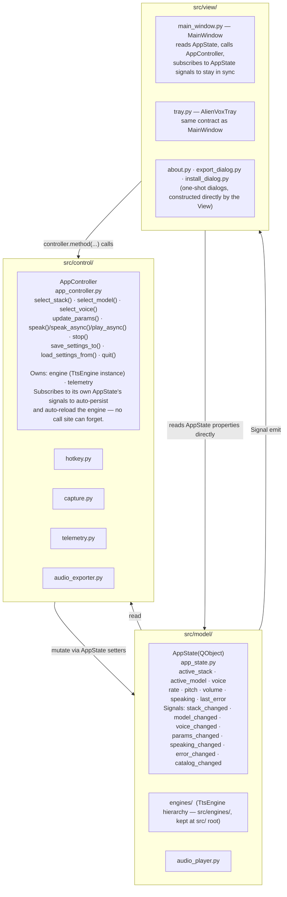

# Architecture Decision Record (ADR)
## ADR-004: UI Architecture Pattern — MVC (AppState + AppController)

| Attribute | Specification |
| :--- | :--- |
| **Status** | Accepted — implemented |
| **Date** | 2026-07-20, implemented 2026-07-21 |
| **Author** | Principal Architect |
| **Project Context** | AlienVox — python_app (AlienTech.Software) |

---

## Context and Problem Statement

The Python app used **MVP with injected callbacks** (`main.py` as Presenter). Every new
user-facing action required a manually wired callback in `MainWindow.__init__` and a corresponding
handler in `main.py`. Two bugs traced directly to this:

- Tab switch didn't swap the engine — `on_stack_changed` callback was never registered.
- Voice change didn't apply — `cfg` dict was updated on disk but not in memory.
- Recurring (reported 3-4 times): the model dropdown always defaulted to `stacks.yaml`'s first
  catalog entry regardless of which model was actually active, because `MainWindow` had no single
  place to read "what's actually active" from — it only had one-shot constructor snapshots.

The root cause was structural: mutable state (`engine`, `active_stack`, `cfg`) lived in closure
variables inside `main.py`. Views could only affect that state through explicitly injected
callbacks, and nothing kept a View's *displayed* state in sync with the Presenter's actual state
after construction. Forgetting one callback, or one resync call, meant a silently broken or
mismatched UI.

---

## Decision

**Adopted MVC**, using Qt's native signal/slot mechanism to make the Model side observable —
this is a Qt-idiomatic hybrid of textbook MVC and MVVM, but the codebase calls it MVC because the
mutation authority (`AppController`) and the observable state (`AppState`) are separate classes,
matching the Controller/Model split in the name.

### Layers, as implemented

**Key invariant**: Views (`MainWindow`, `AlienVoxTray`) hold **no state of their own** beyond
widget contents, and those widget contents are always driven by an `AppState` signal handler —
never a constructor snapshot and never a separate "push" method called ad hoc from outside. Views
call `AppController` methods in response to user input; they never mutate `AppState` directly.

### Why this closes the recurring bug class

- **Single source of truth**: `AppState` is the only place `active_stack`/`active_model`/`voice`
  live. There is no closure variable in `main.py` and no constructor snapshot in `MainWindow` that
  can drift from it.
- **Automatic reload/persist**: `AppController.__init__` subscribes to its *own* `AppState`'s
  signals (`stack_changed`, `model_changed` → reload engine + persist; `voice_changed`,
  `params_changed` → persist). A new call site that changes state cannot forget to trigger these
  side effects — they aren't attached to the call site at all, they're attached to the state change
  itself.
- **Reactive Views**: `MainWindow`/`AlienVoxTray` subscribe to `AppState`'s signals in `__init__`
  and update their widgets from *any* source of change (their own combo, the other View, Load
  Settings) — not just their own callbacks. This is what makes the tab-switch and mismatched-voice
  bugs structurally impossible rather than "fixed until the next new control forgets to wire up."

### What differs from the original proposal

The original plan (below, superseded) called for a Controller with **zero Qt imports** so it could
be driven from a `CliView` without `QApplication`. What shipped instead makes `AppState` a
`QObject` with `Signal`s (Qt-coupled), while `AppController`'s public methods
(`select_voice`, `speak`, `update_params`, ...) remain plain Python with no Qt types in their
signatures — so a `CliView` is still buildable later (a `QApplication`-free process can construct
`AppState`/`AppController` and call those methods directly; only Signal *emission* needs a Qt
event loop pumping, not Signal *construction*). See `docs/issues/todo_005.md` for that follow-up,
deliberately deferred out of this change.

---

## Consequences

### Benefits (realized)
- `MainWindow`/`AlienVoxTray` shrank from ~15-parameter callback-injection constructors to
  `(app_state, controller)`.
- New user actions are `controller.method(...)` calls plus (if the state they touch is new)
  a signal + setter on `AppState` — not a new callback parameter threaded through every View
  constructor.
- Regression tests (`tests/test_app_state.py`, `tests/test_app_controller.py`,
  `tests/test_main_window.py`) exercise the Model/Controller without a running engine or a real
  `QApplication` event loop beyond widget construction.

### Trade-offs (accepted)
- `AppState` being a `QObject` means it can't be constructed or its signals fired without at least
  one `QApplication` instance existing in the process (tests use a module-scoped `qapp` fixture).
- Every View must remember to `blockSignals()` while reactively repopulating a combo box from a
  state-driven handler, or it re-triggers its own "user changed this" handler. This is a real
  sharp edge — see `.agents/SKILLS/highlevel_design/SKILL.md` §7.3 for the concrete pattern.

---

## Related Decisions

- ADR-001 — Python + PySide6 stack selection.
- `docs/issues/todo_005.md` — CLI surface sharing `AppController` with the GUI (deferred).
- `SKILLS/highlevel_design/SKILL.md` §7 — current MVC pattern documentation and the
  controller-command wiring convention.
