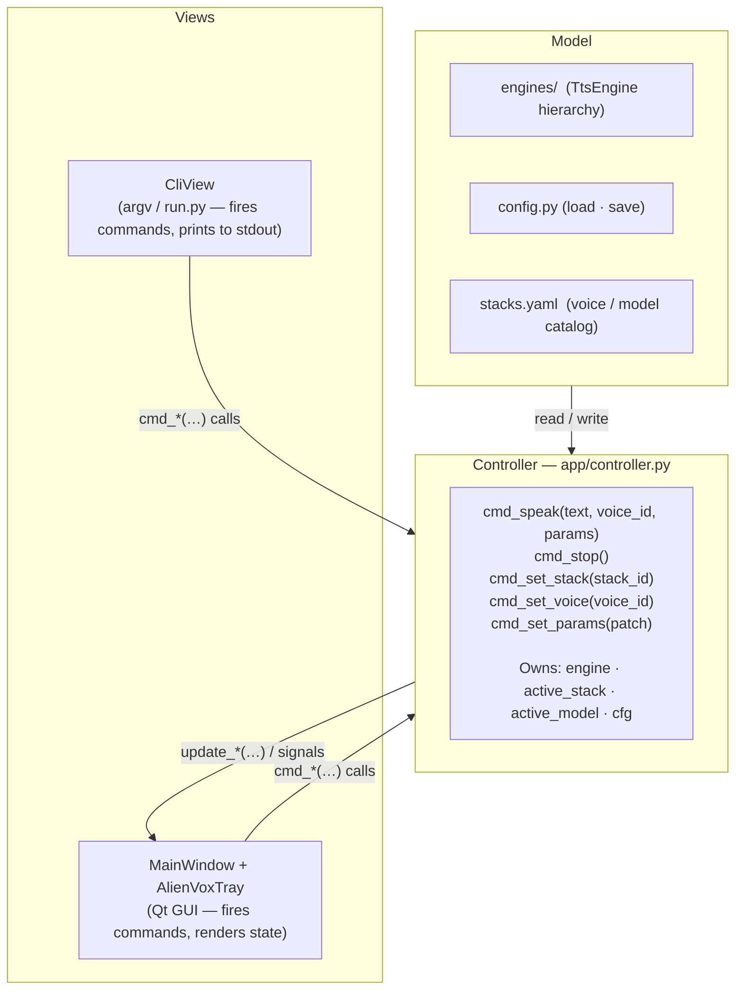

# Architecture Decision Record (ADR)
## ADR-004: UI Architecture Pattern — MVC with CLI-ready Controller

| Attribute | Specification |
| :--- | :--- |
| **Status** | Proposed — not yet implemented |
| **Date** | 2026-07-20 |
| **Author** | Principal Architect |
| **Project Context** | AlienVox — python_app (AlienTech.Software) |

---

## Context and Problem Statement

The current Python app uses **MVP with injected callbacks** (`main.py` as Presenter). Every new
user-facing action requires a manually wired callback in `MainWindow.__init__` and a corresponding
handler in `main.py`. Two bugs already traced to missing wires:

- 2026-07-20: tab switch didn't swap the engine — `on_stack_changed` callback was never registered.
- 2026-07-20: voice change didn't apply — `cfg` dict was updated on disk but not in memory.

The root cause is structural: the Presenter holds mutable state (`engine`, `active_stack`, `cfg`)
in closure variables. Views can only affect that state through explicitly injected callbacks.
Forgetting one callback means silently broken behaviour.

Additionally, `run.py` already exists as an entry point for CLI subcommands (`app`, `download`).
The current architecture makes adding more CLI commands difficult: all logic is entangled with
`QApplication` setup in `main.py`.

---

## Decision

**Adopt MVC** — extract a `Controller` class that owns all application state and command logic,
leaving Views as thin event sources.

### Layers

### Why MVC over MVP (current) and MVVM

| | MVP (current) | MVC (proposed) | MVVM |
| :--- | :--- | :--- | :--- |
| State ownership | Closure vars in `main.py` | `Controller` class | `ViewModel(QObject)` |
| New action wiring | Manual callback injection | Call `controller.cmd_*()` | Connect Qt Signal |
| CLI surface | Requires separate Presenter | `CliView` shares Controller | Qt Signals don't map to CLI |
| Missing-wire risk | Silent bug (seen twice) | Compile error if `cmd_*` missing | Runtime if signal not connected |
| Qt coupling | Low | **None** in Controller | High (QObject, Signal everywhere) |

MVC wins specifically because the Controller has **zero Qt imports** — it can be instantiated from
a CLI entry point (`run.py`) or a test without a `QApplication`. MVVM ties state to `QObject`
signals, making the CLI path awkward.

---

## Implementation Scope

**Not implementing now.** Estimated cost when the time comes:

| Dimension | Estimate |
| :--- | :--- |
| **Tokens** | ~12 k output tokens — new `controller.py` (~200 lines) + refactor of `main.py` (~150 lines changed) + `MainWindow.__init__` simplification (~80 lines) + `CliView` stub (~50 lines) |
| **Dev time** | ~3–4 h — extract Controller, replace closure vars, rewire MainWindow, smoke-test all callbacks, update tests |
| **Risk** | Medium — `main.py` closure vars are read by many inner functions; nonlocal rewiring must be exact. Biggest unknown: `speak_async` thread safety once engine lives on Controller rather than closure. |

Migration steps when adopted:

1. Create `src/controller.py` — `AppController` class with `cmd_*` methods; no Qt imports.
2. Move `engine`, `active_stack`, `active_model`, `cfg` from `main.py` closures into `AppController.__init__`.
3. Replace all callback injections in `MainWindow.__init__` with `controller.cmd_*` method references.
4. `main.py` becomes: `QApplication` bootstrap → `AppController()` → `MainWindow(controller)` → `exec()`.
5. Add `CliView` in `run.py`: parse `argv` → call `controller.cmd_*()` → print result.
6. Update `SKILLS/highlevel_design/SKILL.md` §7 to reflect MVC as current pattern.

---

## Consequences

### Benefits
- Controller is independently unit-testable without `QApplication`.
- CLI subcommands (`run.py speak`, `run.py stop`) share the exact same logic path as the GUI.
- New user actions are `controller.cmd_*()` calls — impossible to forget wiring.
- `main.py` shrinks from ~320 lines to ~50 lines.

### Trade-offs
- Moderate refactor risk during migration (see estimate above).
- Controller must be careful about thread safety for `speak_async` (Qt GUI thread vs audio thread).

---

## Related Decisions

- ADR-001 — Python + PySide6 stack selection.
- ADR-003 (to be written) — Multi-stack TTS engine architecture.
- `SKILLS/highlevel_design/SKILL.md` §7 — current MVP pattern documentation and MVVM comparison.
